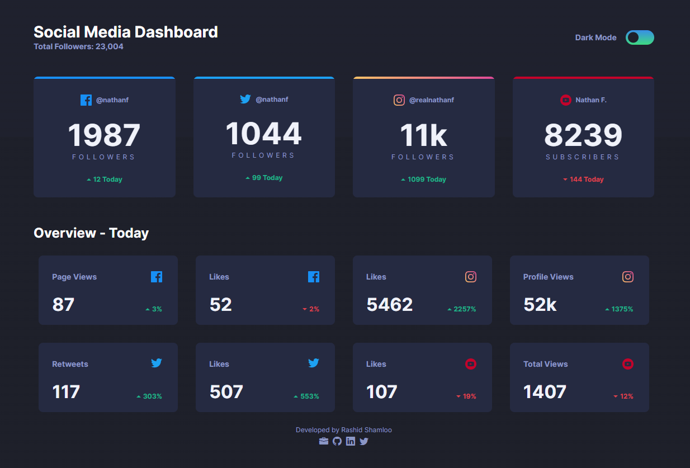

# Front End Mentor - Project 028 - Social Media Dashboard with Theme Switcher

This is a solution to the [Social Media Dashboard with Theme Switcher challenge on Frontend Mentor](https://www.frontendmentor.io/challenges/social-media-dashboard-with-theme-switcher-6oY8ozp_H).

## Table of contents

- [Overview](#overview)
  - [Screenshot](#screenshot)
  - [Links](#links)
- [My process](#my-process)
  - [Built with](#built-with)
  - [What I learned](#what-i-learned)
  - [Useful resources](#useful-resources)
- [Author](#author)

## Overview

### Screenshot

- Desktop

- Mobile

### Links

- Solution URL: https://github.com/rashidshamloo/fem_028_social-media-dashboard-with-theme-switcher/
- Live Site URL: https://rashidshamloo.github.io/fem_028_social-media-dashboard-with-theme-switcher/

## My process

### Built with

- Vite / Vue.js
- Tailwind CSS
- Semantic HTML5 markup

### What I learned

- Implementing components in Vue.js using the Composition API (`<script setup>`)
- Using TypeScript in Vue.js
- How switching between dark mode and light mode works in Tailwind CSS
- Implementing a dark/light mode toggle using Tailwind CSS and JavaScript
- Using "localStorage" to store the theme mode
- Automatic Tailwind CSS class sorting using Prettier
- More experience in using Grid and Flex Box

### Useful resources

- [Grid Areas for Tailwind CSS](https://savvywombat.com.au/tailwind-css/grid-areas/) - The grid area plugin for Tailwind CSS that i used

## Author

- Frontend Mentor - [@rashidshamloo](https://www.frontendmentor.io/profile/rashidshamloo)
- Portfolio - [rashidshamloo.ir](https://www.rashidshamloo.ir)
- Twitter - [@rashidshamloo](https://www.twitter.com/rashidshamloo)
